# Ejercicio 4: GIT. Colaborar en un proyecto de sofware libre. Pull Request (PR)
## Introducción
En este ejercicio se trabajará el uso y funcionamiento del Pull Request. Para esto se le realizará un fork al repositorio que posteriormente habrá que modificar para por último con un Pull Request pedirle al propietario original que añada los cambios realizados. 
## Desarrollo
Para realizar este ejercicio lo primero que habrá que hacer es ir al repositorio prueba-pr-iaw_202526 de lgarciavelazquez y hacer un fork para lo cual hay que clicar el botón que se encuentra el lado superior derecho en el cual pone fork.   

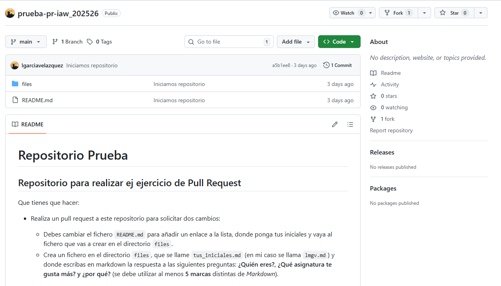

Tras clicar en fork saldrá una pantalla cuyo título será Create a new fork donde habrá que colocar el nombre deseado para el repositorio en el campo Repository name, además es recomendable poner una descripción para el fork. También deberás activar la opción Copy de master branch only si solo quieres copiar la rama máster y no el resto de ramas. Por último, deberás clicar en el icono verde Create fork.    

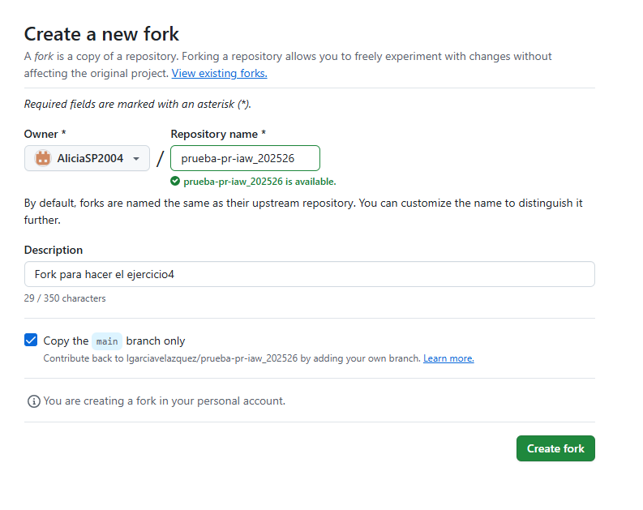

Este último paso creará un nuevo repositorio en tu cuenta con la información del repositorio al que se le ha hecho fork.

Teniendo el repositorio ya en nuestra cuenta habrá que ir al equipo en el que trabajaras que en mi caso trabajaré desde Visual Studio Code accediendo por ssh a mi Debian 13 donde se encuentra todos los repositorios de GitHub.  
Tras acceder al Debian13 el primer paso es clonar el repositorio de GitHub en la máquina virtual para lo cual he utilizado el comando **git clone https: //AliciaSP2004:ghp_ZK...@K16jrtj1yHFYG@github.com/AliciaSP2004/prueba-pr-iaw_202526 .git**. Se puede observar que en el comando se utiliza la partícula git clone qué es propio del lenguaje de GitHub seguida del enlace https del repositorio al cual se le añaden después de // el nombre del usuario de GitHub:el toquen del usuario de GitHub junto con un @.  
  
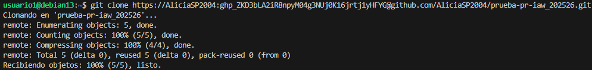

Después de clonar el repositorio hay que utilizar el comando **cd** para entrar en él y posteriormente hay que crear una nueva rama para realizar los cambios y que así no se realicen directamente sobre main para lo cual hay que utilizar el comando **git branch alicia** donde alicia es el nombre que le he otorgado a la nueva rama. Es importante trabajar sobre la rama creada por lo que justo después de crearla habrá que entrar en ella con el comando **git checkout alicia**. 
  
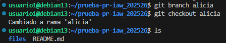

Ya en la rama correcta he realizado un ls para determinar qué hay dentro del repositorio que será una carpeta llamada files donde se encuentran los archivos markdown de cada alumno y un readme.md.  
El siguiente paso que he hecho ha sido entrar en la carpeta files con un **cd files** donde he creado un nuevo documento markdown llamado ASP.md con el comando **nano ASP.md** donde he respondido a las preguntas que se pierden en el ejercicio utilizando varios marcadores.   
  
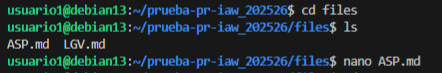  
  
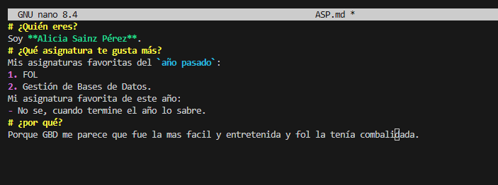

Después de guardar el documento markdown he salido de la carpeta files con un **cd ..** para así poder entrar en el archivo readme.md el cual he modificado añadiendo un enlace al archivo markdown qué he creado anteriormente.  
  
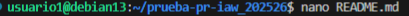  
  
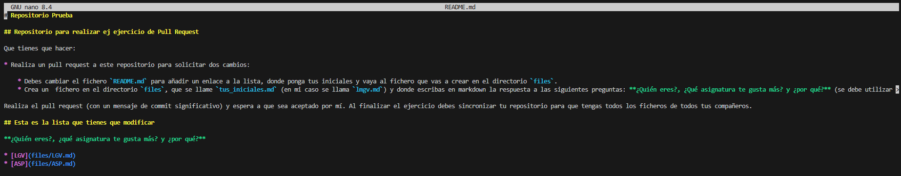

Tras realizar todos los cambios necesarios al repositorio prueba-pr-iaw_202526 he hecho un **gid add .** para preparar los cambios y un **git commit -m “creado en files el archivo ASP.md y modificado README.md”** para guardar los cambios.  
  
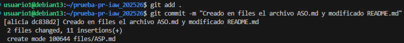

Además, también he hecho un **git push origin alicia** para subir los cambios al repositorio de GitHub.  
  
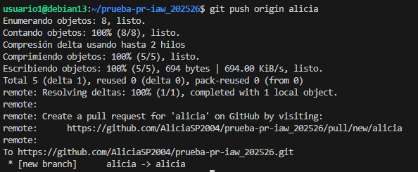

El último paso para realizar este ejercicio es hacer un Pull Request desde GitHub para lo cual habrá que ir al repositorio y clicar en el botón verde Compare & pull request tras lo cual deberás escribirle un comentario al propietario original del repositorio para clicando el botón verde Create pull request enviarle el pull request.  
  
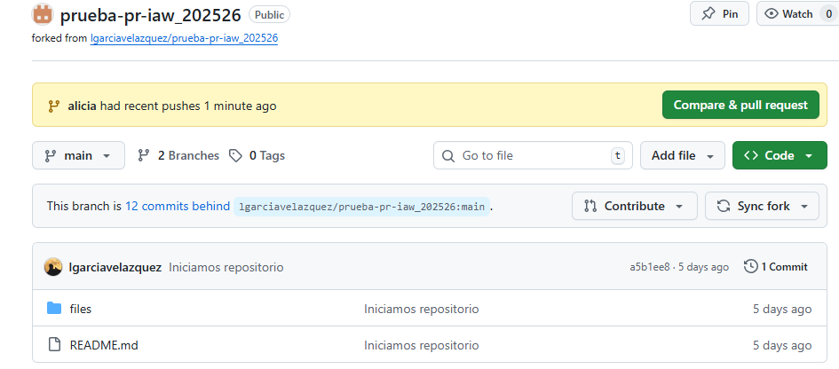  
  
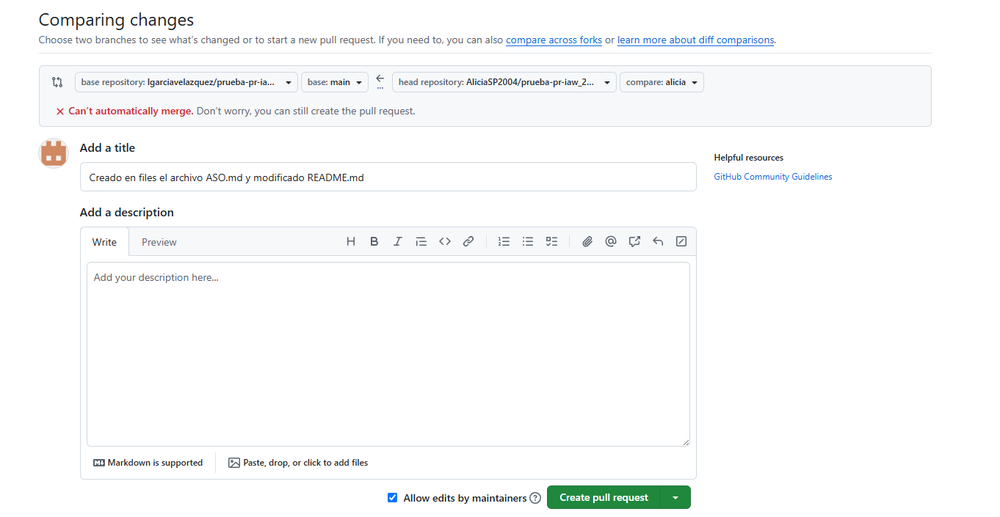

Tras yo realizar el Pull Request el propietario original de repositorio deberá comprobar que los cambios efectuados son correctos tras lo cual hará un Merge pull request para unir la información de su rama main con la que he creado. El propietario original también tendrá que solucionar los conflictos que puedan ocurrir al juntar la información de ambas ramas.
Para tu poder ver el repositorio actualizado con la información de todos los miembros del equipo hay que ir al repositorio propio de GitHub y clicar en el icono Sync fork.  
  
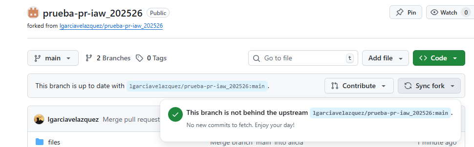  
  
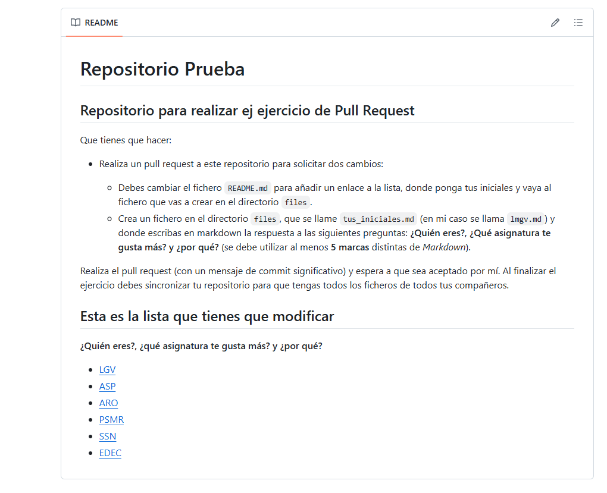
